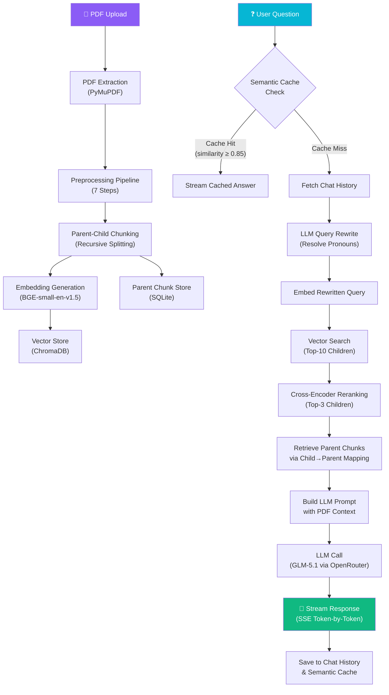

# 📄 NB-LLM — PDF Knowledge Base with RAG

[](https://huggingface.co/spaces/Arkraptor/docLens_v1)

> **This is Version 1 of the [DocLens](https://github.com/Abdulwahab30/DocLens) project.**
>
> DocLens v1 (this repo) handles text-based PDFs only. The full DocLens platform adds **OCR for scanned documents**, **multimodal understanding** (images, charts, diagrams), **multi-document querying**, and more. This version is a functional foundation that demonstrates the core RAG pipeline — use it to get started, then upgrade to DocLens for production workloads.

---

> **Ask questions about your PDF documents using a production-grade Retrieval-Augmented Generation (RAG) pipeline with real-time streaming responses.**

NB-LLM is a full-stack application that lets you upload PDF documents and have intelligent, context-aware conversations about their content. It uses a sophisticated multi-stage retrieval pipeline with parent-child chunking, semantic search, cross-encoder reranking, semantic caching, and LLM-powered answers streamed in real-time.

---

## 🏗️ System Architecture



---

## 📋 Table of Contents

- [How It Works](#-how-it-works)
  - [1. PDF Extraction](#1-pdf-extraction)
  - [2. Preprocessing Pipeline](#2-preprocessing-pipeline)
  - [3. Chunking Strategy](#3-chunking-strategy-parent-child-architecture)
  - [4. Embeddings](#4-embeddings)
  - [5. Vector Store](#5-vector-store)
  - [6. RAG Query Pipeline](#6-rag-query-pipeline)
  - [7. Streaming Responses](#7-streaming-responses)
- [Tech Stack](#-tech-stack)
- [Project Structure](#-project-structure)
- [Setup & Installation](#-setup--installation)
- [API Reference](#-api-reference)
- [Frontend Features](#-frontend-features)

---

## 🔬 How It Works

### 1. PDF Extraction

**Module:** `backend/pdf_reader.py`  
**Library:** [PyMuPDF (fitz)](https://pymupdf.readthedocs.io/)

The extraction phase reads each page of the uploaded PDF and extracts:

| Extracted Data | Method |
|---|---|
| **Text content** | `page.get_text("text")` — raw text extraction |
| **Tables** | `page.find_tables()` → `table.extract()` — structured table data |
| **Scanned page detection** | Pages with `< 30` characters of text are flagged as `is_scanned: true` |

Each page produces a dictionary with `page` number, `text`, `tables`, and `is_scanned` flag.

---

### 2. Preprocessing Pipeline

**Module:** `backend/preprocessing.py`

After extraction, each page goes through a **7-step preprocessing pipeline** designed to clean noisy PDF text and produce high-quality input for chunking:

| Step | Function | What It Does |
|---|---|---|
| 1 | `detect_repeated_headers_footers()` | Scans the first/last 2 lines of every page, counts frequency, removes lines appearing on ≥ 40% of pages |
| 2 | `remove_headers_footers()` | Strips the detected repeated header/footer lines from each page |
| 3 | `remove_repeated_page_numbers()` | Removes standalone page number lines (e.g., `"Page 3"`, `"- 12 -"`, `"42"`) |
| 4 | `fix_broken_lines()` | Rejoins lines broken mid-sentence by PDF layout (merges lines not ending with `.?!:;`) while preserving headings and bullet points |
| 5 | `remove_references_noise()` | Strips common PDF noise: `"Confidential"`, `"All Rights Reserved"`, copyright notices, long URLs, and isolated reference markers `[1]`, `[23]` |
| 6 | `normalize_spaces()` | Collapses multiple spaces to single space, multiple newlines to double newlines, removes tabs |
| 7 | `mark_headings()` | Detects headings (numbered headings, ALL CAPS, title-case short lines) and wraps them with `## ` markdown prefix for structure preservation |

**Additionally:** Tables extracted in step 1 are formatted into markdown-style text (`format_tables()`) and appended to each page's text.

---

### 3. Chunking Strategy (Parent-Child Architecture)

**Module:** `backend/chunker.py`

NB-LLM uses a **Parent-Child chunking architecture** — a two-tier approach that optimizes both retrieval precision and answer quality:

```
┌─────────────────────────────────────────────────────┐
│                 PARENT CHUNK (~2000 tokens)          │
│  Contains full context for the LLM to reason over   │
│                                                     │
│  ┌──────────────┐  ┌──────────────┐  ┌────────────┐ │
│  │ CHILD CHUNK  │  │ CHILD CHUNK  │  │ CHILD CHUNK│ │
│  │ (~650 tokens)│  │ (~650 tokens)│  │(~650 tokens│ │
│  │              │  │              │  │            │ │
│  │  Embedded &  │  │  Embedded &  │  │ Embedded & │ │
│  │  Searched    │  │  Searched    │  │ Searched   │ │
│  └──────────────┘  └──────────────┘  └────────────┘ │
└─────────────────────────────────────────────────────┘
```

**Why Parent-Child?**
- **Child chunks** (smaller, ~650 tokens) are embedded and searched — smaller text windows match queries more precisely
- **Parent chunks** (larger, ~2000 tokens) are sent to the LLM — more context produces better, more complete answers
- When a child chunk matches, its **parent** is retrieved, giving the LLM the surrounding context it needs

#### Recursive Splitting Strategy

Text is split using a **recursive, multi-level strategy** that tries each splitter in order, falling back to the next if the result is still too large:

```
Level 1: Section boundaries (headings)
    ↓ (if still too large)
Level 2: Paragraph boundaries (double newlines)
    ↓ (if still too large)
Level 3: Bullet list boundaries
    ↓ (if still too large)
Level 4: Sentence boundaries (., !, ?)
    ↓ (if still too large)
Level 5: Hard token-limit split (word-level)
```

#### Overlap Merging

Chunks include **token overlap** to preserve context at boundaries:
- **Parent overlap:** 150 tokens
- **Child overlap:** 100 tokens

The overlap text is taken from the end of the previous chunk and prepended to the next chunk.

#### Configuration

| Parameter | Default | Purpose |
|---|---|---|
| `child_chunk_tokens` | 650 | Target size per child chunk |
| `child_overlap_tokens` | 100 | Overlap between consecutive child chunks |
| `parent_chunk_tokens` | 2000 | Target size per parent chunk |
| Token estimation | `len(text) // 4` | Fast approximation (~4 chars per token) |

---

### 4. Embeddings

**Module:** `backend/embeddings.py`  
**Model:** [`BAAI/bge-small-en-v1.5`](https://huggingface.co/BAAI/bge-small-en-v1.5) via `sentence-transformers`

| Property | Value |
|---|---|
| Model | BAAI/bge-small-en-v1.5 |
| Embedding dimension | 384 |
| Normalization | `normalize_embeddings=True` (unit vectors for cosine similarity) |
| Use case | Embedding child chunks for vector search + embedding queries for semantic cache |

Two functions are exposed:
- `embed_texts(texts)` — Batch-embeds a list of texts (used during document ingestion)
- `embed_query(query)` — Embeds a single query string (used during search and cache)

---

### 5. Vector Store

**Module:** `backend/vector_store.py`  
**Database:** [ChromaDB](https://www.trychroma.com/) (Persistent Client)

| Property | Value |
|---|---|
| Storage path | `data/chroma_db/` |
| Collection name | `pdf_child_chunks` |
| Stored per chunk | ID, document text, embedding vector, metadata |
| Metadata fields | `child_id`, `parent_id`, `document_id`, `page` |
| Search method | Cosine similarity (via embeddings) |
| Search scope | Filtered by `document_id` |

**Operations:**
- `add_child_chunks()` — Batch-adds child chunks with embeddings and metadata
- `search_child_chunks()` — Queries the collection for the top-K nearest child chunks, filtered by document
- `delete_document_vectors()` — Removes all vectors for a given document

---

### 6. RAG Query Pipeline

**Module:** `backend/rag_service.py`

When a user asks a question, the following pipeline executes:

#### Step 1: Semantic Cache Check
- The question is embedded and compared (cosine similarity) against all cached question embeddings for that document
- If similarity ≥ **0.85**, the cached answer is returned immediately (streamed word-by-word)
- **Storage:** SQLite table `semantic_cache` with columns: `document_id`, `question`, `embedding` (JSON), `answer`, `sources`
- This avoids redundant LLM API calls for semantically identical questions, greatly reducing latency and API costs.

#### Step 2: Conversational Query Rewriting (Memory)
- The system fetches the last 3 turns of chat history from SQLite.
- If history exists, an LLM call rewrites the user's question into a standalone query (resolving pronouns like "he", "it", "there").
- Example: *"What role did he have there?"* → *"What role did John Doe have in the GIS Visualization project?"*
- This enables robust multi-turn conversations where vector search continues to perform well on follow-up questions.

#### Step 3: Vector Search (Top-10 Candidates)
- The rewritten query is embedded using `BAAI/bge-small-en-v1.5`
- ChromaDB returns the **top-10** most similar child chunks (filtered by `document_id`)
- Results include text, metadata (parent_id, page), and distance score

#### Step 4: Cross-Encoder Reranking (Top-3)

**Module:** `backend/reranker.py`  
**Model:** [`cross-encoder/ms-marco-MiniLM-L-6-v2`](https://huggingface.co/cross-encoder/ms-marco-MiniLM-L-6-v2)

- Each candidate child chunk is paired with the question: `[question, chunk_text]`
- The cross-encoder scores each pair for relevance
- Results are sorted by score, filtered by a **minimum threshold of 1.5**
- If no chunks exceed the threshold, the single highest-scored chunk is kept
- Final output: **top-3** chunks

> **Why reranking?** Bi-encoder (embedding) search is fast but approximate. Cross-encoders jointly process the question and passage together, producing far more accurate relevance scores — at the cost of being slower (hence applied only to the top-10 candidates).

#### Step 4: Parent Chunk Retrieval
- Each selected child chunk's `parent_id` is used to retrieve the corresponding parent chunk from SQLite
- Duplicate parent IDs are deduplicated
- Parent text is truncated to fit within **2000 tokens** of total context

#### Step 5: LLM Generation

| Property | Value |
|---|---|
| Provider | [OpenRouter](https://openrouter.ai/) |
| Model | `z-ai/glm-5.1` |
| Temperature | 0 (deterministic) |
| Max tokens | 800 |
| Streaming | SSE (Server-Sent Events), token-by-token |
| Retries | 3 attempts with exponential backoff |
| Rate limit handling | Automatic retry on HTTP 429 |
| Quota exceeded | Graceful error message on HTTP 402 |

The prompt instructs the LLM to:
- Answer **only** from the provided PDF context
- Not use outside knowledge or guess
- Mention page numbers when possible
- Return `"I could not find this information in the PDF."` if the answer isn't available
- Consider the provided recent conversation history to answer follow-up questions cohesively.

#### Step 7: Post-Response Storage
After the stream completes, the answer is saved to:
- **Chat History** (SQLite `chat_history` table) — for display in the history panel
- **Semantic Cache** (SQLite `semantic_cache` table) — for future cache hits

---

### 7. Streaming Responses

**Backend:** `StreamingResponse` with `text/event-stream` media type  
**Frontend:** `ReadableStream` API with real-time DOM updates

The `/ask-stream` endpoint uses **Server-Sent Events (SSE)** to deliver the LLM response token-by-token:

```
data: {"type": "token", "content": "The"}
data: {"type": "token", "content": " answer"}
data: {"type": "token", "content": " is..."}
data: {"type": "sources", "sources": [...], "confidence": "high"}
data: {"type": "done"}
```

**Event types:**

| Event | Purpose |
|---|---|
| `token` | A single text token from the LLM |
| `sources` | Source pages and confidence level |
| `done` | Stream complete signal |
| `error` | Error message |

The frontend reads the stream with a `ReadableStream` reader, parsing each SSE line and appending tokens to the chat bubble with a blinking cursor animation.

---

## 🛠️ Tech Stack

| Component | Technology |
|---|---|
| **Backend Framework** | FastAPI |
| **ASGI Server** | Uvicorn |
| **PDF Parsing** | PyMuPDF (fitz) |
| **Embeddings** | sentence-transformers (BAAI/bge-small-en-v1.5) |
| **Vector Database** | ChromaDB (persistent) |
| **Reranker** | sentence-transformers CrossEncoder (ms-marco-MiniLM-L-6-v2) |
| **Database** | SQLite (documents, parent chunks, chat history, semantic cache) |
| **LLM Provider** | OpenRouter API (GLM-5.1) |
| **Frontend** | Vanilla HTML, CSS, JavaScript |
| **Font** | Google Fonts — Outfit |

---

## 📁 Project Structure

```
NB-LLM/
├── backend/
│   ├── __init__.py
│   ├── main.py              # FastAPI app, routes, endpoints
│   ├── pdf_reader.py         # PDF text & table extraction
│   ├── preprocessing.py      # 7-step text cleaning pipeline
│   ├── chunker.py            # Recursive parent-child chunking
│   ├── embeddings.py         # BGE embedding model
│   ├── vector_store.py       # ChromaDB vector operations
│   ├── reranker.py           # Cross-encoder reranking
│   ├── rag_service.py        # RAG pipeline (streaming + non-streaming)
│   ├── database.py           # SQLite operations
│   ├── parent_store.py       # (Legacy) JSON-based parent storage
│   └── storage/
│       └── pdfs/             # Uploaded PDF files
├── frontend/
│   ├── index.html            # Main UI
│   ├── index.css             # Styling (glassmorphism dark theme)
│   └── index.js              # Chat logic, SSE stream consumer
├── data/
│   ├── app.db                # SQLite database
│   └── chroma_db/            # ChromaDB persistent storage
├── Dockerfile                # Single-container build for Hugging Face Spaces (port 7860)
├── Dockerfile.backend        # Multi-container backend (port 8000, used with docker-compose)
├── .env                      # API keys
├── requirements.txt          # Python dependencies
└── README.md                 # This file
```

---

## 🚀 Setup & Installation

You can run NB-LLM on **Hugging Face Spaces**, via **Docker**, or via a **Local Installation**.

### Option A: Deploy on Hugging Face Spaces (Easiest)

1. Go to [huggingface.co/new-space](https://huggingface.co/new-space), pick **Docker** as the SDK, and create the Space.
2. In your Space → **Settings → Repository secrets**, add:
   ```
   OPENROUTER_API_KEY = sk-or-v1-your-key-here
   ```
3. Clone the Space repo and push this project into it:
   ```bash
   git clone https://huggingface.co/spaces/YOUR_USERNAME/YOUR_SPACE_NAME
   # copy project files in, then:
   git add . && git commit -m "initial deploy" && git push
   ```
4. The Space builds automatically. Watch progress in the **Logs** tab.
5. Open the Space URL — the app is live.

> **Note on storage:** Hugging Face Spaces has ephemeral storage — uploaded PDFs and the database reset on each restart. For persistence, enable the [Spaces persistent storage addon](https://huggingface.co/docs/hub/spaces-storage) (~$5/month) or use an external DB.

---

### Option B: Run with Docker (Local)

NB-LLM features a multi-container architecture (Nginx frontend + FastAPI backend via Conda).

1. Ensure **Docker** and **Docker Compose** are installed on your machine.
2. Clone the repository and navigate to the directory:
   ```bash
   git clone https://github.com/your-username/NB-LLM.git
   cd NB-LLM
   ```
3. Create a `.env` file in the project root and add your OpenRouter API key:
   ```env
   OPENROUTER_API_KEY="sk-or-v1-your-api-key-here"
   ```
4. Build and start the containers:
   ```bash
   docker-compose up --build
   ```
5. Open **http://localhost** in your browser.

---

### Option C: Local Installation

#### Prerequisites

- **Python 3.10+**
- **pip** (Python package manager)
- An **OpenRouter API key** ([get one here](https://openrouter.ai/))

#### Step 1: Clone the Repository

```bash
git clone https://github.com/your-username/NB-LLM.git
cd NB-LLM
```

#### Step 2: Create a Virtual Environment

```bash
python -m venv venv

# Windows
.\venv\Scripts\activate

# macOS/Linux
source venv/bin/activate
```

#### Step 3: Install Dependencies

```bash
pip install -r requirements.txt
```

#### Step 4: Configure Environment Variables

Create a `.env` file in the project root:

```env
OPENROUTER_API_KEY="sk-or-v1-your-api-key-here"
```

#### Step 5: Run the Application

```bash
uvicorn backend.main:app --host 127.0.0.1 --port 8000 --reload
```

Then open **http://127.0.0.1:8000** in your browser.

> **Note:** On first launch, the application will download the embedding model (`BAAI/bge-small-en-v1.5`, ~130MB) and reranker model (`ms-marco-MiniLM-L-6-v2`, ~90MB) from Hugging Face. This only happens once.

---

## 📡 API Reference

### Upload PDF
```
POST /upload
Content-Type: multipart/form-data

Body: file (PDF file)

Response:
{
  "message": "PDF processed successfully",
  "document_id": "example_document",
  "pages": 42,
  "parent_chunks": 15,
  "child_chunks": 48
}
```

### Ask Question (Non-Streaming)
```
POST /ask
Content-Type: application/json

Body:
{
  "document_id": "example_document",
  "question": "What is the main finding?"
}

Response:
{
  "answer": "According to page 12...",
  "confidence": "high",
  "retrieved_parent_count": 3,
  "sources": [{"page": 12, "parent_id": "..."}]
}
```

### Ask Question (Streaming)
```
POST /ask-stream
Content-Type: application/json

Body:
{
  "document_id": "example_document",
  "question": "What is the main finding?"
}

Response: text/event-stream
data: {"type": "token", "content": "According "}
data: {"type": "token", "content": "to "}
data: {"type": "token", "content": "page 12..."}
data: {"type": "sources", "sources": [...], "confidence": "high"}
data: {"type": "done"}
```

### Debug Retrieval
```
POST /debug-retrieval
Content-Type: application/json

Body: {"document_id": "...", "question": "..."}

Response: Candidate results, reranked results, and parent chunks
```

### List Documents
```
GET /list-documents

Response: {"documents": [...]}
```

### Get Document Status
```
GET /get-document-status/{document_id}

Response: Document metadata including status, pages, chunks
```

### Delete Document
```
DELETE /delete-document/{document_id}

Response: {"message": "Document deleted successfully"}
```

### Reindex Document
```
POST /reindex-document/{document_id}

Response: Updated chunk counts after reprocessing
```

### Chat History
```
GET /chat-history/{document_id}

Response: {"document_id": "...", "history": [...]}
```

---

## 🎨 Frontend & System Features

- **Multi-turn Conversation Memory**: Automatically rewrites follow-up questions using chat history so pronouns and context carry over perfectly into vector search.
- **Semantic Caching**: Identical or highly similar questions (cosine similarity ≥ 0.85) instantly return cached answers, reducing LLM costs and latency.
- **Scanned PDF Support**: PyMuPDF detects scanned pages (pages with minimal text characters) to flag them for future OCR or alternative processing.
- **Drag-and-drop** PDF upload with visual feedback.
- **Real-time streaming** answers with blinking cursor animation.
- **Source badges** showing which PDF pages were used.
- **Chat history** panel to review past conversations.
- **Glassmorphism dark theme** with animated background blobs.

---

## 📜 License

This project is for educational purposes.
